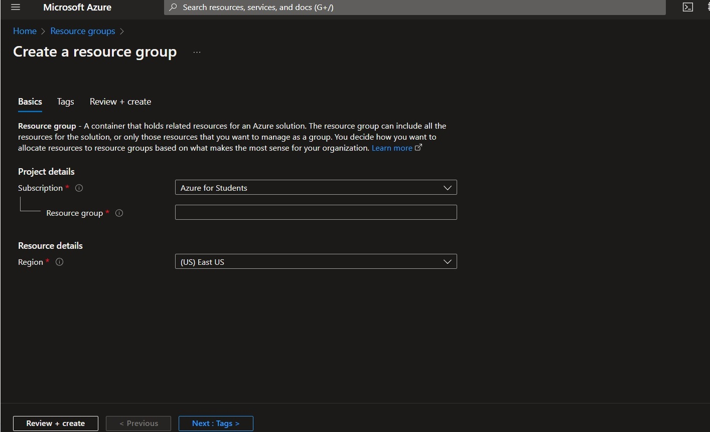
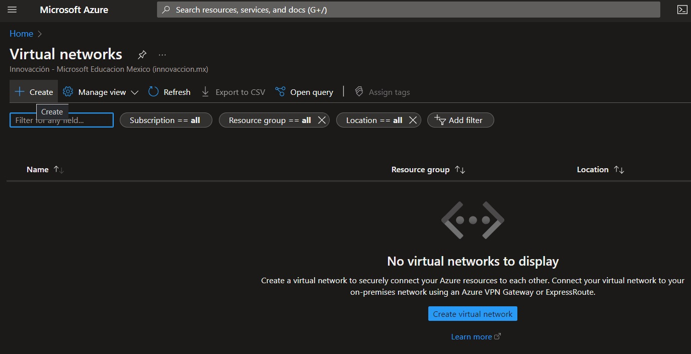
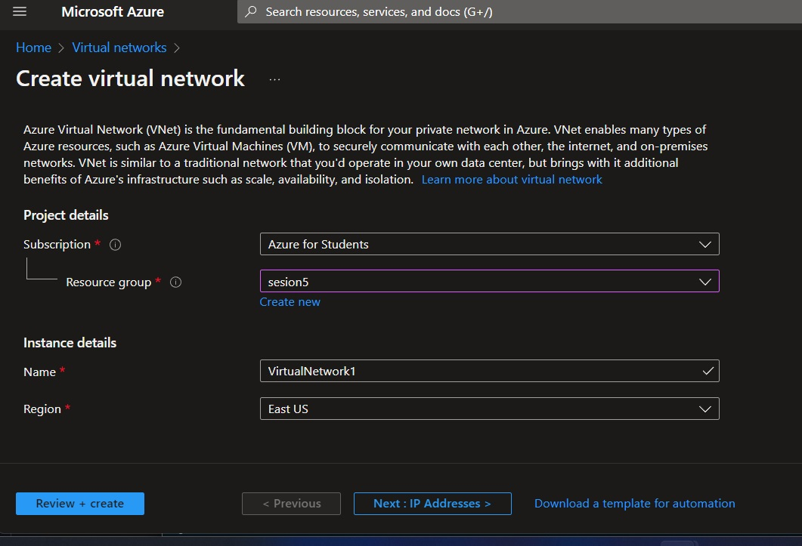
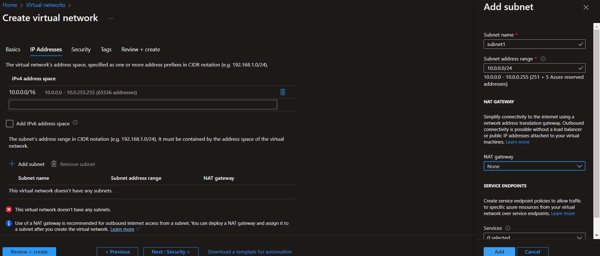
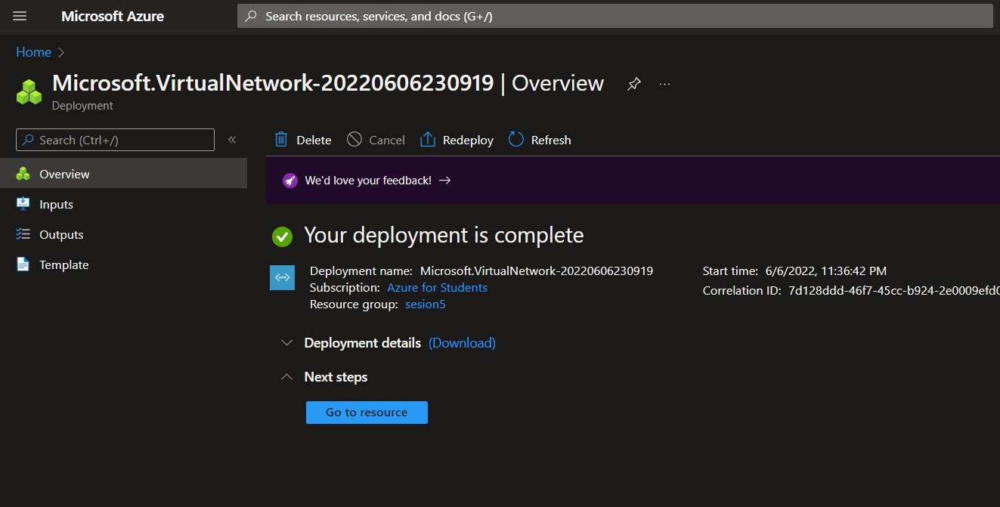

#Practical Virtual Network

----------------------------------------------------------------
##Process:
##### -We started session in Azure [Azure](https://www.portal.azure.com)
##### -We have to create a resource group or you can use an existing one.
##### -we click on the review and create button.

---------------
##### -In the search engine, we look for Virtual Networks and clik on the create button.

##### -We have to select the resource group that we previously created. and set a name.

##### -In the ip address section, we click "add Subnet", on the right, we´ll have to put the name of the subnet and the subnet address range and we click add then click review and create.

##### -We created a virtual network.

----------------------------------------------------------------
##### -When the check is over, we click go to resource.

---------------
##### -We need to create a Virtual Machine.

##### -then, we have to set configuration for the virtual machine.

##### -Then, we have to click go to resource.

##### -When the whole process is finished, we will be shown the details of the VM.
 